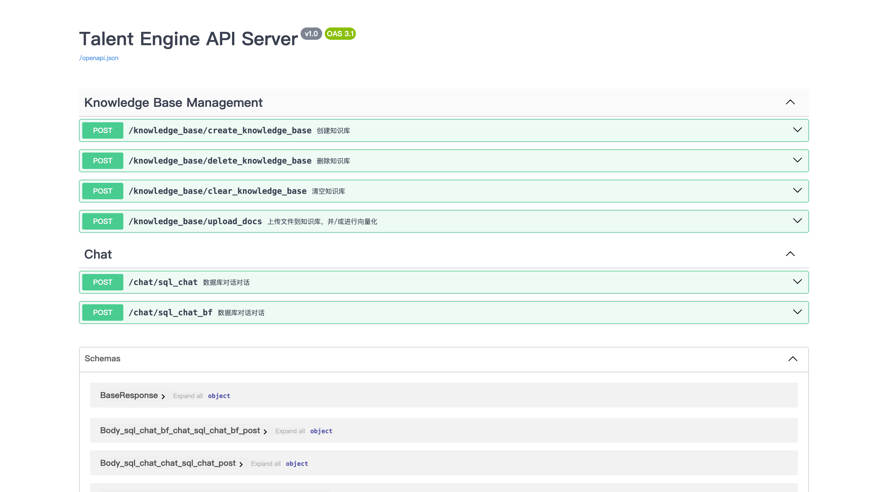
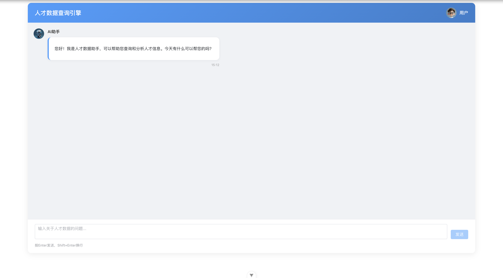
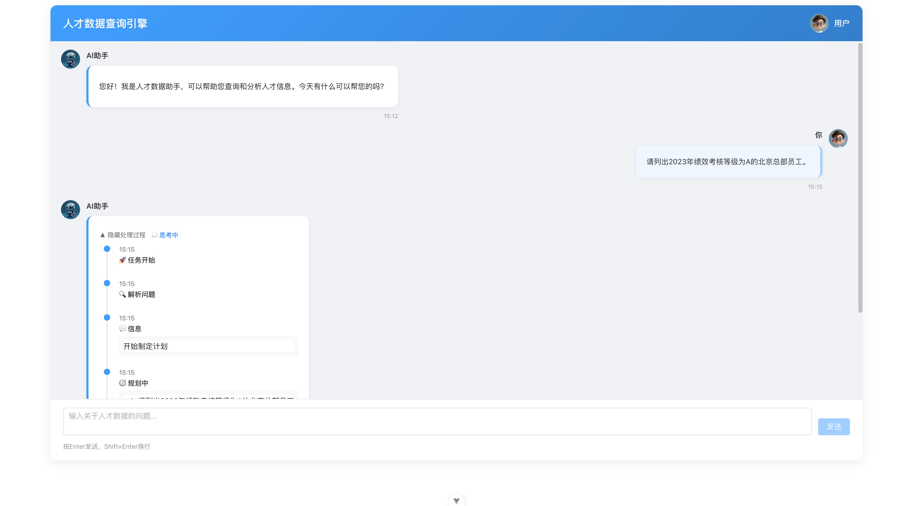
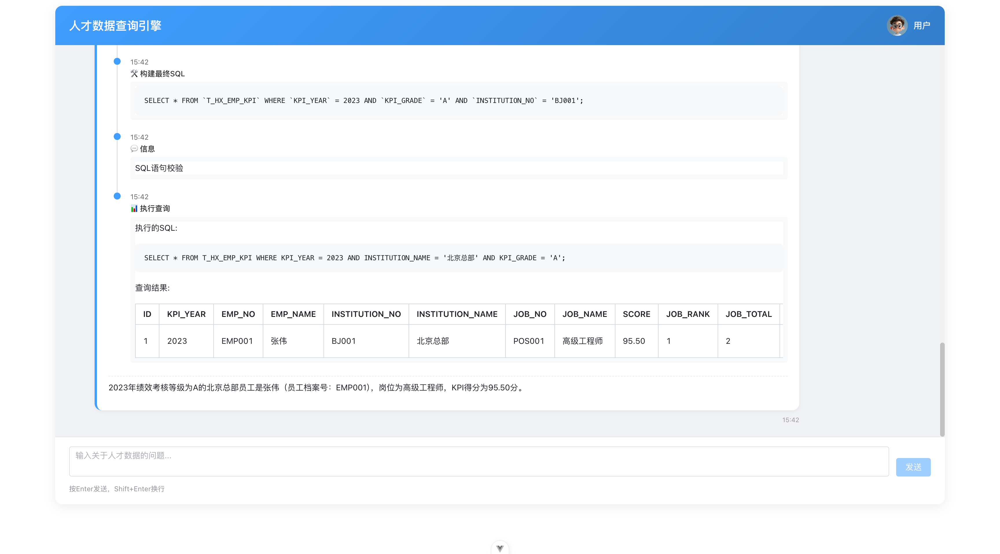

# 💡 项目简介

本项目是一个基于多模型支持的text2sql智能问答系统，结合了向量检索、重排序及大语言模型生成，构建端到端的 text2sql 解决方案。支持的核心模型包括：

* **生成模型**：DeepSeek-V3
* **嵌入模型**：bge-large-zh-v1.5
* **重排序模型**：bge-reranker-large

---

# ⚙️ 配置说明

请根据实际路径修改配置文件：`project/server/config.yaml`。

## 向量数据库配置

```yaml
vector_store:
  type: chroma
  name: rag
  kwargs:
    search_params:
      metric_type: "IP"
      params: { ef: 128 }
    index_params:
      metric_type: "IP"
      index_type: "HNSW"
      params: { M: 16, efConstruction: 200 }
```

## 知识库配置

```yaml
knowledge_base:
  base_storage_path: path/to/your/knowledge_base
  name: talent_engine_deepseek_01
```

## 大语言模型（LLM）配置

```yaml
llm:
  api_key: sk-xxx
  base_url: https://xxx/v1
  model_name: deepseek-chat
  temperature: 1.5
  max_tokens: 10000
  model_engine: openai
```

## Embedding 模型配置

```yaml
embeddings:
  model_name_or_path: text-embedding-ada-002
  model_engine: openai
  dimensions: 1024
  device: cuda:0
  base_url: https://api.gptapi.us/v1
  api_key: sk-xxx
```

## Reranker 模型配置

```yaml
reranker:
  model_name_or_path: path/to/your/reranker_model
  type: rank
  device: cuda:0
```

## Server 启动配置

```yaml
server:
  api_server_host: 0.0.0.0
  api_server_port: 8888
```

## 数据库配置

```yaml
database:
  db_type: mysql
  host: 10.10.80.67
  port: 3318
  user: root
  password: hjr
  database: talent_engine
  echo: true
```

---

# 🚀 快速开始

## 客户端启动

```bash
cd project/client
npm install
npm run serve
```

## 服务端启动

```bash
cd project/server
uv sync
uv source .venv/bin/activate
python main.py
```

---

# 📷 项目展示

## 服务端界面



## 客户端界面

* 🔹 初始页面
  

* 🔹 提问页面
  

* 🔹 回答效果
  

---

# 📝 说明

* 本项目已集成多模型协同推理机制；
* 请确保服务器有足够显存支持大模型和 embedding 同时加载；
* 更多模型配置请参考 HuggingFace 和 DeepSeek 官方文档。